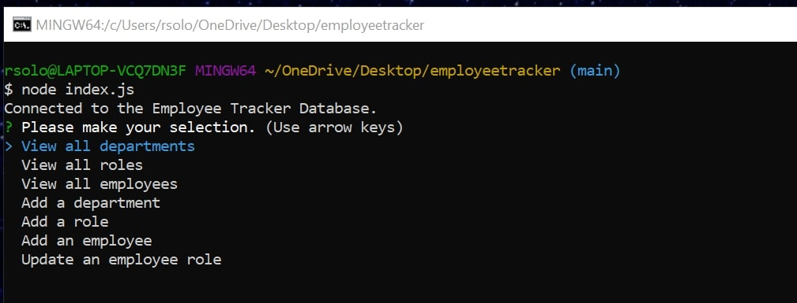
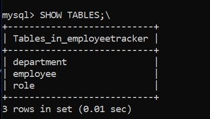
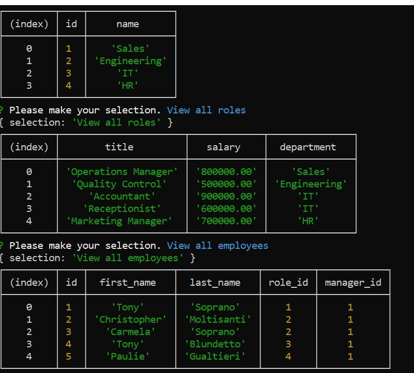

# Rachel-s-Employee-Tracker

## Table of Contents

- [Description](#description)
- [Instructions](#instructions)
- [Github Profile](#github-profile)
- [Link to Employee Tracker](#link-to-employee-tracker)
- [Contribution](#contribution)
- [License](#license)

### **Description**

This Employee tracker will allow you to view and manage the departments, roles, and employees in your company
so that you can organize and plan your business

### **Instructions**

View this Screentastify link for instructions:

-(https://drive.google.com/file/d/1s0JKm7hS1Q9zoEG0oy_CNMeFCCcjKXOI/view)

### **Github Profile**

https://github.com/rsolov23

### **Link to my Employee Tracker**

- https://github.com/rsolov23/Rachel-s-Employee-Tracker

### **Contribution**

Feel free to contribute to this project in any of the following ways:

- [Submit bug and feature requests](https://github.com/rsolov23/Rachel-s-Employee-Tracker/issues)
- [Review Source Code Changes](https://github.com/rsolov23/Rachel-s-Employee-Tracker/pulls) and make pull requests from typos to content

### **License**

Licensed under the [MIT License](https://github.com/rsolov23/Rachel-s-Employee-Tracker/blob/main/LICENSE)

Copyright (c) 2021 Rachel Solov
